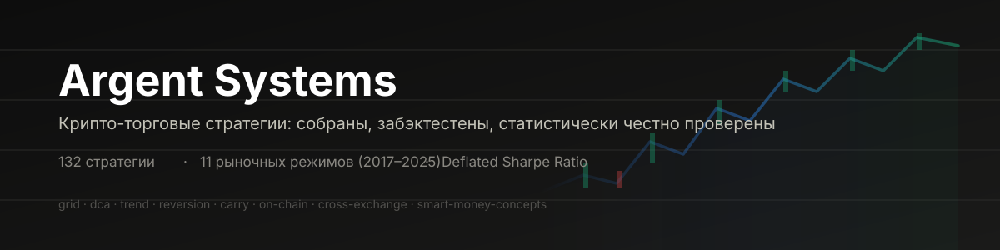
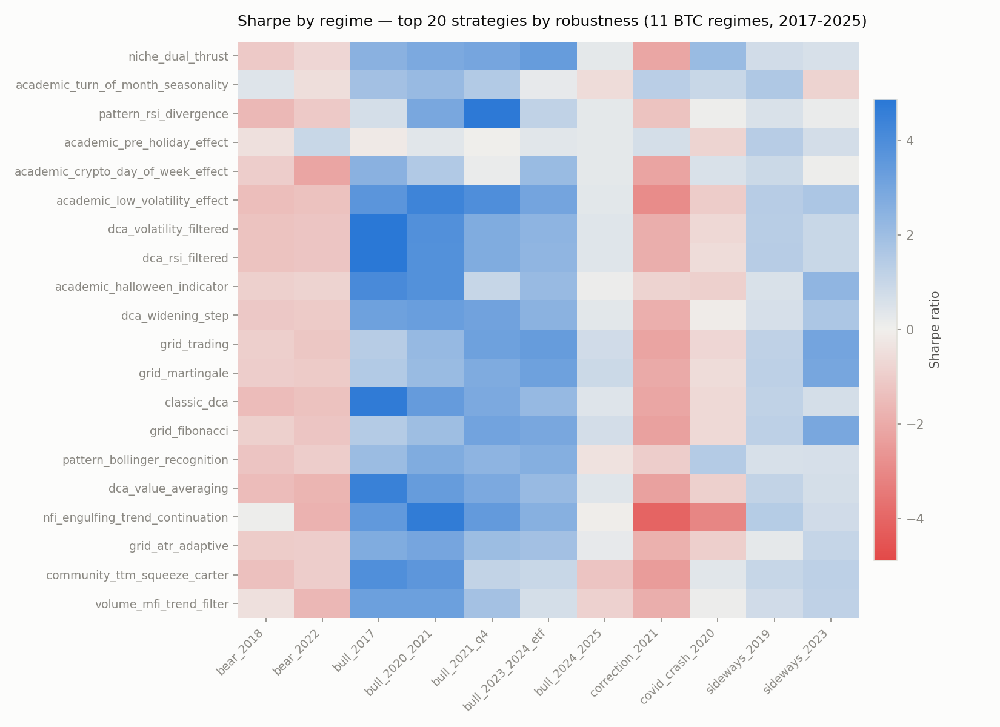
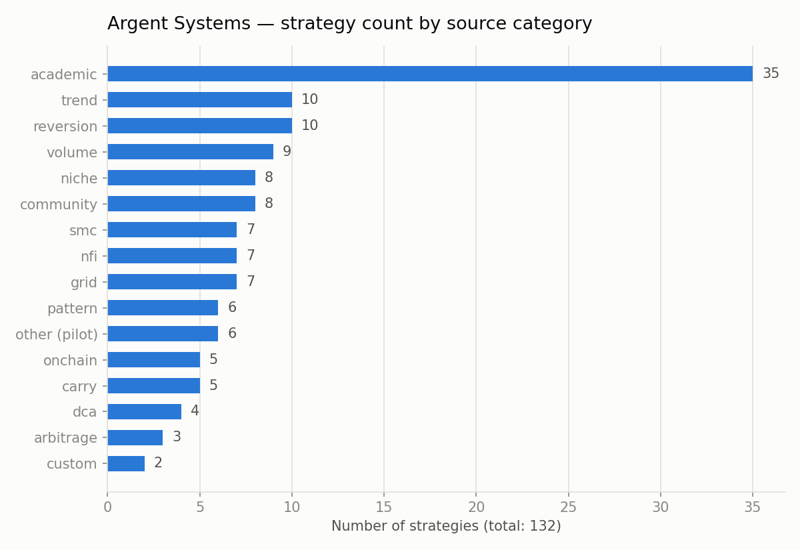
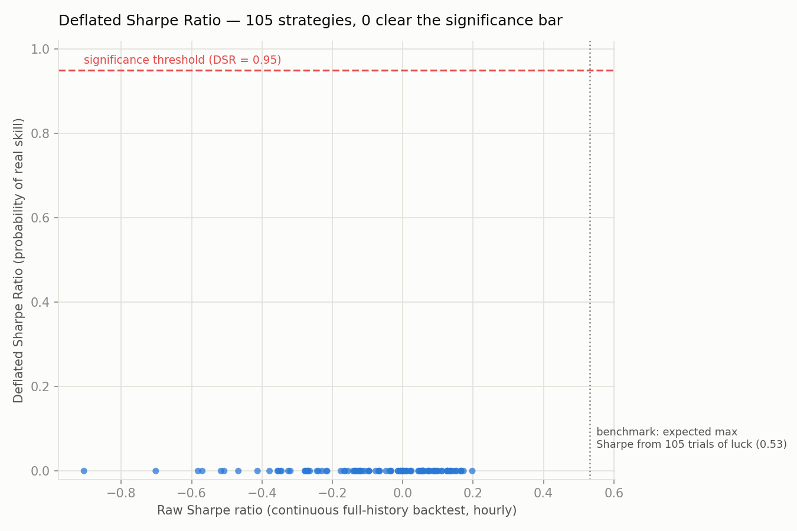
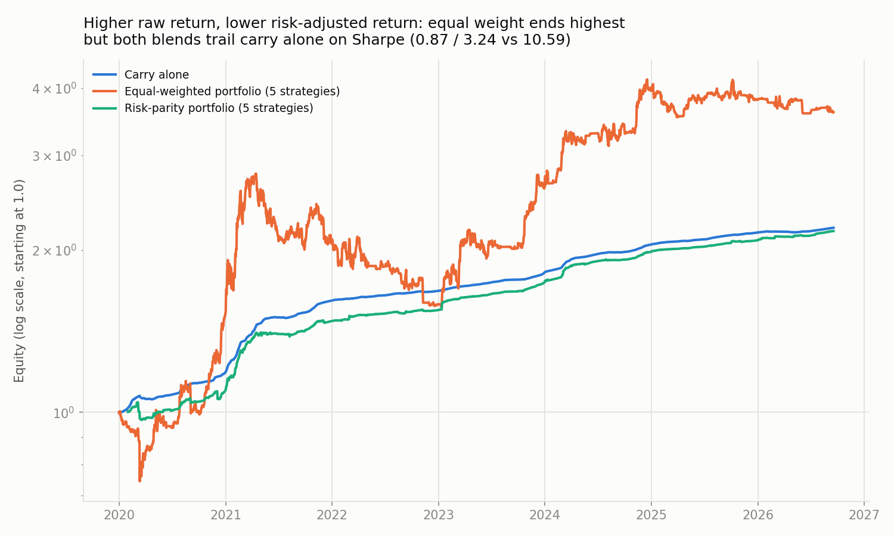

<div align="center">



[](https://www.python.org/)
[](https://github.com/polakowo/vectorbt)
[](#текущий-набор-132-стратегии)
[](tests/test_pipeline.py)
[](#итоговые-выводы-статистическая-проверка)

</div>

Хранилище крипто-торговых стратегий: каждая — изолированный Python-модуль
(без внешних зависимостей друг от друга и от конкретного проекта), плюс общий
бэктестер, который прогоняет их все на одних и тех же данных, ранжирует по
метрикам и **проверяет статистическую значимость результата**, а не просто
красивый Sharpe на одном периоде.

Цель — насмотренность: собрать как можно больше реальных механик (из
топовых и нишевых open-source репозиториев, академических работ, ICT/SMC
методологии), проверить их честным бэктестом и держать под рукой как
материал для придумывания собственных стратегий.

## Содержание

- [Быстрый старт](#быстрый-старт)
- [Контракт модуля стратегии](#контракт-модуля-стратегии)
- [Структура](#структура)
- [Текущий набор (132 стратегии)](#текущий-набор-132-стратегии)
- [Метрики сравнения](#метрики-сравнения)
- [Итоговые выводы (статистическая проверка)](#итоговые-выводы-статистическая-проверка)

## Быстрый старт

```bash
python3 -m venv .venv && source .venv/bin/activate
pip install -r requirements.txt

python backtest/run.py --symbol BTC/USDT --timeframe 1h --since 2021-01-01
```

Результат — таблица в консоли + `results/comparison.csv`, отсортировано по Sharpe.

Отдельно — funding-rate carry стратегии (`carry_*.py`, торгуют не движение
цены, а саму ставку финансирования на перпетуалах):

```bash
python backtest/run_carry.py --symbol BTC/USDT:USDT --since 2022-01-01
```

И on-chain стратегии (`onchain_*.py`, торгуют BTC по метрикам сети —
хэшрейт, активные адреса, доход майнеров — от blockchain.info, без ключей):

```bash
python backtest/run_onchain.py --since 2020-01-01
```

Кросс-режимная проверка устойчивости (гоняет все ценовые стратегии на
11 разных отрезках BTC — вся торгуемая на Binance история с 2017 года:
бум 2017, зима 2018, боковик 2019, covid-обвал 2020, бум 2020-21,
коррекция и второй бум 2021, медведь 2022, боковик 2023, ETF-ралли,
текущий бычий — вместо одного удобного периода):

```bash
python backtest/run_regimes.py --symbol BTC/USDT --timeframe 1h
```

<p align="center"></p>

Результат — `results/regime_comparison.csv` (детали по каждому режиму) и
`results/regime_comparison_robustness.csv` (сколько режимов из 11
стратегия прошла в плюс). **Максимум — 8 из 11 положительных режимов**,
и лучшая по среднему Sharpe в этой группе — `niche_dual_thrust` (найдена в
малоизвестном репо `jesse-ai/example-strategies`, не топовая классика).
Grid/DCA-стратегии, лидировавшие в тесте на одном бычьем периоде, здесь
держат крепкие 7/11 — режимы резких обвалов (`covid_crash_2020`,
`correction_2021`) им не по зубам, но в остальном они устойчивы.

Самопроверка пайплайна без сети (синтетические данные):

```bash
python tests/test_pipeline.py
```

## Контракт модуля стратегии

Каждый файл в `strategies/*.py` (кроме `registry.py`) обязан объявить:

```python
META = {
    "name": "...",              # уникальное имя
    "category": "...",          # grid / dca / mean_reversion / trend_following / ...
    "source": "...",            # ссылка на репозиторий-источник или "classic concept"
    "license": "...",           # лицензия источника, если код/логика оттуда
    "description": "...",
    "default_params": {...},
}

def signals(df: pd.DataFrame, **params) -> pd.Series:
    """Целевой вес позиции на каждый бар, индекс = df.index.
    1.0 = весь капитал в лонге, 0.0 = вне рынка, -1.0 = весь капитал в шорте.
    """
```

`df` — OHLCV со столбцами `open, high, low, close, volume`. Файл просто
кладётся в `strategies/` — `registry.py` подхватывает его автоматически,
регистрировать руками не нужно.

Исключение — `carry_*.py`: у них `META["data_type"] = "funding_rate"`, а
`df` вместо OHLCV содержит колонку `funding_rate` (из `data/funding.py`).
Их считает не `backtest/run.py`, а `backtest/run_carry.py` — модель PnL там
принципиально другая (доход не от движения цены, а от самой выплаты
финансирования).

`onchain_*.py` — вариант попроще: `META["data_type"] = "onchain"`, `df` это
обычный OHLCV BTC/USDT (дневной) плюс склеенные on-chain колонки
(`unique_addresses`, `hash_rate`, `miners_revenue_usd`,
`transaction_volume_usd`, `market_cap_usd` — из `data/onchain.py`). PnL тут
всё ещё от движения цены, поэтому считает тот же `backtest/run.py`
(`run_backtest(df, data_type="onchain")`) — просто `backtest/run_onchain.py`
сначала склеивает данные перед вызовом.

`arbitrage_*.py` — та же схема, `META["data_type"] = "cross_exchange"`,
`df` содержит `close` (BTC/USDT на Binance) плюс `coinbase_premium_pct`
(из `data/cross_exchange.py`). Это НЕ буквальное исполнение арбитража —
на дневных свечах невозможно честно смоделировать спред, который реальные
арбитражёры закрывают за секунды; премия используется как рыночный
сигнал (аналог публичного индикатора "Coinbase Premium Index"), а не как
цель для одновременного исполнения на двух биржах.

Такой интерфейс (вес позиции по бару) специально не завязан ни на один
конкретный бэктест-движок или прод-систему — чтобы стратегию потом было
легко забрать в любой другой проект и адаптировать под его исполнение.

## Структура

```
data/fetch.py                # OHLCV с Binance через ccxt, кэш в data/cache/*.parquet
data/funding.py               # история funding rate перпетуалов (для carry_*.py)
data/onchain.py                # on-chain метрики BTC с blockchain.info (для onchain_*.py)
data/cross_exchange.py         # межбиржевая премия Binance/Coinbase (для arbitrage_*.py)
strategies/                    # каждая стратегия — один файл
backtest/run.py                # прогоняет ohlcv-, onchain- и cross_exchange-стратегии
backtest/run_carry.py          # прогоняет carry_*.py (funding-rate PnL, не ценовой)
backtest/run_onchain.py        # склеивает BTC OHLCV + on-chain, вызывает run.py
backtest/run_cross_exchange.py # склеивает BTC close + межбиржевую премию, вызывает run.py
backtest/run_regimes.py        # прогоняет все ценовые стратегии на 11 режимах BTC (2017-2025)
backtest/deflated_sharpe.py    # поправка Sharpe на количество попыток + ненормальность
backtest/tune_composite.py     # walk-forward перебор параметров (train/test split)
backtest/portfolio_diversification_check.py  # корреляции + equal-weight/risk-parity портфели
docs/generate_charts.py        # генерирует графики из results/*.csv для этого README
tests/test_pipeline.py         # самопроверка на синтетических данных (все контракты)
```

## Текущий набор (132 стратегии)

<p align="center"></p>

Каждая — с указанием реального источника и лицензии в
`META["source"]`/`META["license"]`. Полный список: `ls strategies/*.py`,
детали каждой — в её docstring/META. По префиксу файла:

| Префикс | Кол-во | Что это |
|---|---|---|
| `academic_` | 35 | Опубликованные научные работы (Time Series Momentum, 52-Week High, Dual Momentum, day-of-week/сезонные эффекты в BTC, NFP/jobless-claims momentum и fade, ...) — из `paperswithbacktest.com`/Quantpedia |
| `trend_` | 10 | Трендследящие (Supertrend, Ichimoku, ADX/DMI, Parabolic SAR, Vortex, ...) |
| `reversion_` | 10 | Mean-reversion осцилляторы (z-score, VWAP, Stochastic RSI, CCI, Williams %R, ...) |
| `volume_` | 9 | Объёмные/order-flow (OBV, VWAP-тренд, Volume Profile POC, Elder Force Index, ...) |
| `niche_` | 8 | Найдено в малоизвестных репо (Dual Thrust, KDJ, Fisher Transform, Turtle Soup, ...) |
| `community_` | 8 | Порты популярных TradingView community-индикаторов (TTM Squeeze, Waddah Attar, Coppock Curve, ...) |
| `smc_` | 7 | ICT / Smart Money Concepts (Order Block, Breaker Block, BOS/CHoCH, Optimal Trade Entry, Kill Zone) — честно проверены, большинство не работает наивно, одна версия исправлена через обнаружение зон на старшем таймфрейме |
| `nfi_` | 7 | Переработанные условия входа из `iterativv/NostalgiaForInfinity` |
| `grid_` | 7 | Grid-боты (мартингейл, инверсный шорт, ATR-адаптивный, хедж-грид, ...) |
| `pattern_` | 6 | Свечные/паттерн-стратегии из `je-suis-tm/quant-trading` (Heikin-Ashi, London Breakout, ...) |
| `onchain_` | 5 | On-chain метрики BTC (NVT Ratio, Hash Ribbon, Puell Multiple, Metcalfe-дивергенция, ...) |
| `carry_` | 5 | Funding-rate carry на перпетуалах (статичный, порог, z-score, momentum, реверс на панике) |
| `dca_` | 4 | DCA-варианты (RSI/волатильность-фильтрованный, value-averaging, ...) |
| `arbitrage_` | 3 | Межбиржевая премия Binance/Coinbase как сигнал (тренд, реверс на экстремуме, пороговый режим) |
| `custom_` | 2 | Собственные composite-стратегии (regime-switching v1/v2) — обе НЕ превзошли свои же компоненты по отдельности, см. выводы ниже |
| остальное | 6 | Первые пилотные: `classic_dca`, `grid_trading`, `rsi_mean_reversion`, `macd_trend`, `bollinger_breakout`, `donchian_channel` |
| прочее | 1 | `dom_capitala_main_grid` — MAIN-грид из приватного проекта `dom-capitala007` того же владельца, транскрибирован для честного сравнения (не для публичного переиспользования, см. лицензию файла) |

Источники: классические TA-концепции (public domain), `je-suis-tm/quant-trading`
(Apache-2.0), `jesse-ai/example-strategies` (MIT), `paulcpk/freqtrade-strategies-that-work`
(MIT), опубликованные академические статьи (JFE/JF/JPM/RFS/...) из `paperswithbacktest.com`
и Quantpedia, `iterativv/NostalgiaForInfinity` (GPL-3.0 — переосмыслена логика, код не
копировался), ICT/Smart Money Concepts (публичная методология), TradingView
community-скрипты (публичные формулы) и другие — везде, где лицензия источника
неясна, стратегия помечена как "logic only, reimplemented". Один файл
(`dom_capitala_main_grid.py`) имеет проприетарную лицензию (тот же владелец) и
не предназначен для внешнего переиспользования — это не блокирует остальной
репозиторий с открытыми/публичными концепциями.

## Метрики сравнения

`total_return_pct`, `sharpe`, `max_drawdown_pct`, `win_rate_pct`, `num_trades`.
Все стратегии бэктестятся с одинаковой комиссией (`--fee`, по умолчанию 0.1%
за ордер) на одном и том же символе/таймфрейме — сравнение честное только
в этих рамках, кросс-символьное ранжирование пока не считается.

## Итоговые выводы (статистическая проверка)

Пайплайн собран и наполнен — следующий вопрос был не "сколько ещё стратегий
добавить", а "какой из результатов вообще заслуживает доверия". Несколько
дополнительных скриптов отвечают на это честно, а не оптимистично:

### 1. Deflated Sharpe Ratio

<p align="center"></p>

(Bailey & López de Prado, 2014) — `backtest/deflated_sharpe.py` — поправка
сырого Sharpe на количество протестированных стратегий (эффект
множественного тестирования) и на ненормальность доходностей (жирные
хвосты). Результат на непрерывном бэктесте всей истории BTC (не по
режимам, а один честный прогон): **0 из 101-105 ценовых стратегий проходят
порог значимости (DSR ≥ 0.95)** — ни на дневных, ни на часовых данных. Это
означает, что усреднение Sharpe по 11 режимам — более мягкая метрика, чем
честный непрерывный бэктест, и не должно приниматься как доказательство
edge. Результаты: `results/deflated_sharpe.csv` (дневные),
`results/deflated_sharpe_1h.csv` (часовые).

### 2. Портфельная диверсификация

<p align="center"></p>

`backtest/portfolio_diversification_check.py` — проверка гипотезы
"комбинация из низкокоррелированных стратегий (тренд + календарь + on-chain
+ funding-carry + межбиржевая премия) статистически значимее любой из них
по отдельности". Корреляции действительно низкие (carry практически не
коррелирует ни с чем: 0.00-0.05), но:

- Равные веса (Sharpe 0.87) — хуже, чем просто держать
  `carry_static_positive_funding` в одиночку (Sharpe 10.59) — разбавление
  явного лидера явными аутсайдерами невыгодно, хотя равновзвешенный
  портфель и заканчивает с более высокой сырой доходностью (выше волатильность).
- Risk-parity (обратная волатильность, Sharpe 3.24) — лучше равных весов,
  но всё ещё хуже сольного carry, и добавляет отрицательную асимметрию
  (skew -2.25), которой у carry одного не было.
- **Практический вывод**: диверсификация помогает, когда качество
  стратегий сопоставимо — не тогда, когда одна на порядок превосходит
  остальные.

### 3. Sortino / CVaR / просадка

Честная оценка риска (не просто Sharpe, который одинаково штрафует апсайд
и даунсайд) — `results/risk_summary.csv`. `carry_static_positive_funding`
показывает положительную асимметрию (skew +3.34) и максимальную просадку
всего -1.5% за 2020-2026 — Sharpe 10+ математически корректен (проверено
на сырых данных ставки финансирования: ~11.76% годовых, только 14%
принтов отрицательные), это не ошибка расчёта. **Но** это единственная
нехеджированная ставка на биржу-контрагента (Binance) и на то, что
фандинг останется в среднем положительным — оба условия исторически верны
за протестированный период, но не гарантированы навсегда, и хвостовой
риск, которого не было в 2020-2026, не виден в метриках, посчитанных по
этим же данным.

### 4. ICT / Smart Money Concepts: наивная реализация не работает

Проверили Order Block, Breaker Block, BOS/CHoCH, Optimal Trade Entry и NY
Kill Zone breakout как механические правила (не как визуальное решение
дискреционного трейдера). Результат: `smc_order_block` и
`smc_breaker_block` — одни из худших стратегий в проекте (avg Sharpe
-3.03 и -2.72, 1/11 режимов в плюс, тысячи сделок от перепиловки).
Диагноз: порог обнаружения "импульса" на одном таймфрейме слишком мягкий
для часовых крипто-данных. После переноса обнаружения зон на дневной
таймфрейм (`smc_order_block_htf.py`) — Sharpe вырос до -0.10, режимов в
плюс до 5/11. NY Kill Zone breakout (`smc_ny_killzone_breakout.py`)
провалился во всех 11 режимах без исключения (концепция из форекса, где
есть реальные закрытия сессий — у крипты 24/7 торгов такой структуры нет).
Гипотезы momentum и fade на релизах NFP/пособий по безработице
(`academic_macro_release_momentum.py` / `academic_macro_release_fade.py`)
обе отклонены — ни продолжение, ни разворот не работают устойчиво.

**Главный вывод всей сессии**: ни одна из 132 стратегий пока не доказала
строгую статистическую значимость edge. Собственные composite-попытки
(`custom_regime_adaptive_composite` v1/v2) не превзошли свои же
компоненты. Лучший практический кандидат для дальнейшего изучения —
`carry_static_positive_funding` как отдельная позиция, с оговоркой про
риск контрагента; лучшая находка по методологически честной
кросс-режимной устойчивости — `niche_dual_thrust`. Дальнейшие шаги:
тестировать на действительно новых данных (не повторно использовать одну
и ту же историю BTC), смоделировать реальные риски контрагента/маржи для
carry, и/или подключить принципиально другие источники данных (ончейн для
других активов, ордербук, мультиактивная кросс-секционная ротация),
которые эта поправка на количество попыток пока не затрагивала.
